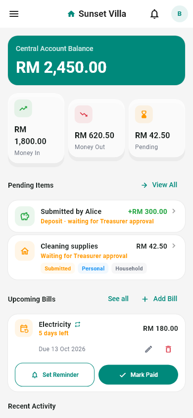
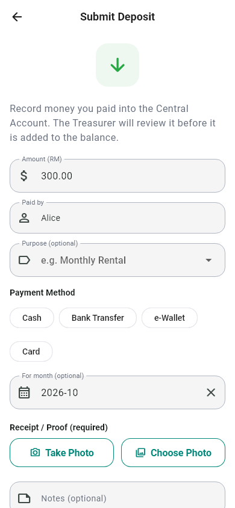
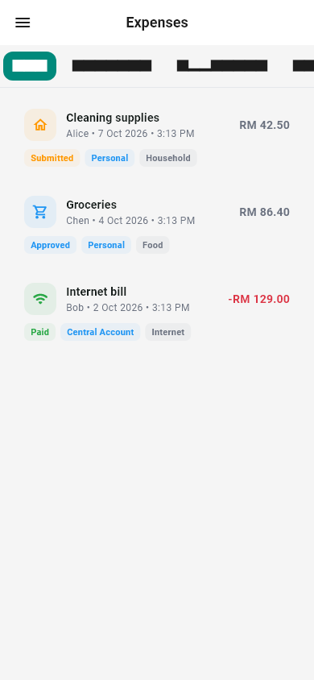
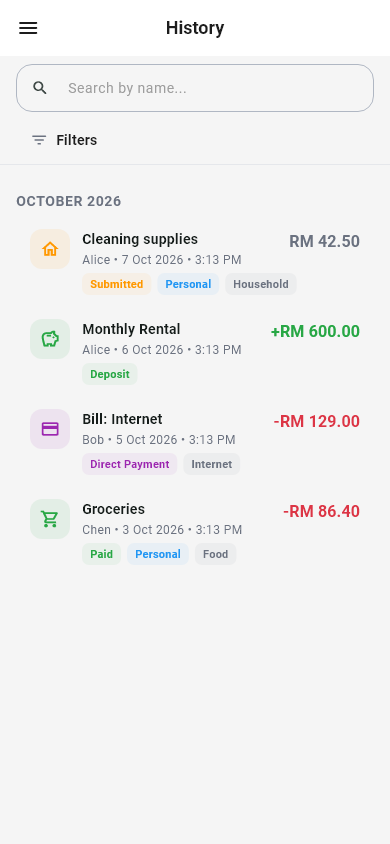
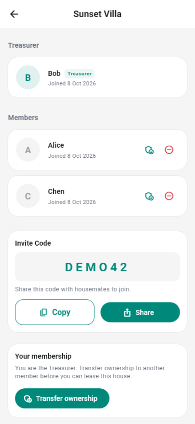

# Rental Ledger

A **Central House Account Management System** for a shared rental house.
Housemates keep one shared Central Account; members claim back what they
spend, deposit money in, and the Treasurer reviews and pays out — with every
movement recorded and visible to the whole house.

**Live web app:** https://rental-ledger-app.web.app

> Rental Ledger is not a bill-splitting app (not Splitwise), not a bank, and
> not a full accounting system. It tracks one shared account and who paid what.

---

## Screenshots

<p align="center">
  
  &nbsp;&nbsp;
  
  &nbsp;&nbsp;
  
</p>

<p align="center">
  
  &nbsp;&nbsp;
  
</p>

<p align="center"><em>Treasurer dashboard &nbsp;·&nbsp; Member "Submit Deposit" &nbsp;·&nbsp; Expense list &nbsp;·&nbsp; History &nbsp;·&nbsp; Members</em></p>

Screenshots use sample data only (no real house or people). They are rendered
from the real app screens by `tool/screenshots/readme_screenshots_test.dart`:

```bash
flutter test --update-goldens tool/screenshots/readme_screenshots_test.dart
```

---

## Features

**Expenses & reimbursements**
- Member buys something with their own money → uploads the receipt → submits
  an expense claim.
- Treasurer approves or rejects (with a reason) → reimburses from the Central
  Account → the claim becomes **Paid**.
- Members can edit or delete their own claim while it is still pending.

**Deposits**
- The Treasurer can record a deposit directly (proof required).
- Members can **Submit Deposit** for money they paid in themselves (proof
  required). It stays **Pending** until the Treasurer approves it — only then
  is it added to the balance. Members can cancel their own pending request.

**Direct payments & bills**
- Treasurer pays household costs straight from the Central Account.
- Recurring and one-off bills with reminders; marking a bill paid records one
  Direct Payment for that month.

**Everything else**
- Dashboard: Central Account balance, money in/out this month, pending items,
  upcoming bills, recent activity.
- Full transaction history, reports with PDF export.
- In-app notifications, members & invite codes, Treasurer transfer.
- English and Bahasa Melayu, light and dark mode.
- Installable as a PWA (add to home screen).

The balance is always the sum of transaction history; transactions are
append-only and every money movement carries its own proof.

---

## Roles

| Action                              | Treasurer | Member |
| ----------------------------------- | :-------: | :----: |
| Submit expense claim                |     ✔     |   ✔    |
| Approve / reject / reimburse claims |     ✔     |   ✘    |
| Record deposit / direct payment     |     ✔     |   ✘    |
| Submit own deposit for approval     |     –     |   ✔    |
| Approve / reject deposit requests   |     ✔     |   ✘    |
| View history and reports            |     ✔     |   ✔    |
| Manage members                      |     ✔     |   ✘    |

These rules are enforced in the app **and** in `firestore.rules`.

---

## Tech stack

- **Flutter / Dart**, Material 3 — one codebase; **Web/PWA is the primary
  target** (Android/iOS builds exist but are frozen for personal use)
- **Riverpod** (state), **GoRouter** (navigation)
- **Firebase**: Authentication, Cloud Firestore, Storage, Cloud Functions,
  Cloud Messaging, Hosting
- **Isar** (local storage)
- Feature-first clean architecture: `presentation → domain → data → Firebase`

```
lib/
  app/        router, theme
  core/       constants, errors, services, shared widgets, utils
  features/   authentication, dashboard, expenses, history, members,
              notifications, reports, settings
  l10n/       app_en.arb, app_ms.arb (+ generated)
docs/         project documentation (start with 01_PROJECT_CONTEXT.md)
firestore-tests/  security-rules tests (Firebase emulator)
functions/    Cloud Functions (joinHouse, membership index)
```

---

## Getting started

Requirements: Flutter (Dart ≥ 3.7), Node.js, the Firebase CLI
(`npm install -g firebase-tools`), and Java (for the Firestore emulator).

```bash
flutter pub get
flutter run -d chrome
```

The app connects to the Firebase project configured in
`lib/firebase_options.dart`.

### Checks

```bash
flutter analyze
flutter test
```

Firestore security-rules tests (starts the emulator automatically):

```bash
cd firestore-tests
npm install
npm test
```

After editing `lib/l10n/*.arb`, regenerate strings with `flutter gen-l10n`.

---

## Deploying the web app

```bash
flutter build web --release
firebase deploy --only hosting
```

When Firestore rules change:

```bash
firebase deploy --only firestore:rules
```

After a deploy, users get the new version by reloading the site (close and
reopen the home-screen app if it still shows the old one).

---

## Documentation

Detailed specs live in [`docs/`](docs):

- `01_PROJECT_CONTEXT.md` — what the app is and is not
- `04_DATABASE.md` — Firestore collections
- `05_BUSINESS_RULES.md` — workflows, permissions, balance rules
- `07_ARCHITECTURE.md` — code structure
- `12_AI_DIRECTION.md` — rules for AI assistants working on this repo
